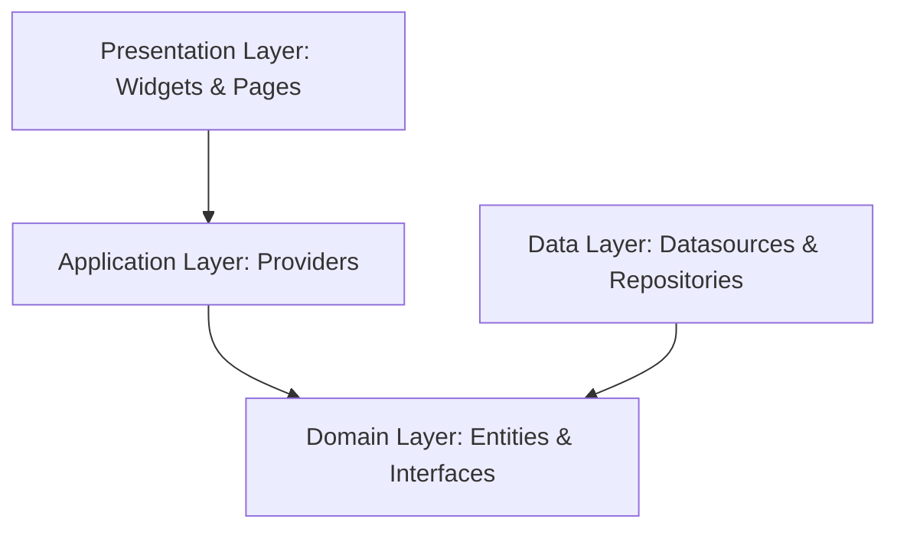

# GariLink Flutter Architecture Guide

This guide details the architectural decisions, software patterns, and conventions used in the GariLink Flutter mobile application.

## 1. Architectural Philosophy

GariLink follows **Clean Architecture** combined with **Domain-Driven Design (DDD)**. The codebase is strictly partitioned into three independent layers to guarantee testability, maintainability, and loose coupling.

### Presentation Layer
*   Contains Flutter widgets, screens, pages, and theme assets.
*   Widgets must be lightweight and declarative.
*   Depends **only** on the Application layer to read state and invoke actions.

### Application Layer
*   Acts as the mediator between the Presentation and Domain/Data layers.
*   Contains **Riverpod Providers**, Notifiers, and state controllers.
*   Manages the local state of widgets, pages, and screen navigation.

### Domain Layer (The Core)
*   Completely independent of Flutter frameworks, database engines, or network clients.
*   Contains:
    *   **Entities**: Pure Dart objects representing core concepts (e.g. `User`, `Listing`, `Vehicle`, `RentalRequest`).
    *   **Value Objects**: Validation wrappers (e.g. `Email`, `PhoneNumber`).
    *   **Exceptions**: Type-safe domain errors.
    *   **Repository Interfaces**: Contracts that define data manipulation methods.

### Data Layer
*   Responsible for concrete data operations.
*   Contains:
    *   **Data Sources**: Direct API callers (e.g., using Dio) or Local Databases.
    *   **Models**: DTO representations of JSON payloads. Must inherit from Domain Entities and contain serialization methods (`fromJson`, `toJson`).
    *   **Repository Implementations**: Implementations of Domain Repository interfaces, executing API calls and caching results.

---

## 2. State Management Strategy

We use **Riverpod** as our state management solution, relying on the `StateNotifier` and `AsyncNotifier` structures.

### Guidelines
1.  **Immutability**: All states must be immutable. Use `@freezed` annotation to define states.
2.  **Async Loading**: For network fetches, use `AsyncValue` to represent loading, success, and error states cleanly.
3.  **Scope**: Local widget state (like form inputs) should be handled via simple `StateProvider` or standard Flutter `StatefulWidget` controllers to avoid inflating global providers.

---

## 3. Network & Storage Layer

### Dio Network Client
*   The `ApiClient` acts as a wrapper around the `Dio` HTTP library.
*   **JWT Injection**: Requests interceptor automatically appends the `Authorization: Bearer <token>` header if available.
*   **Auto Token Refresh**: On receiving a `401 Unauthorized` response, the interceptor pauses the request queue, makes a POST request to `/auth/refresh` using the refresh token, updates local storage, and retries the original request.
*   **Error Mapping**: Network / HTTP failures are mapped to custom domain exceptions (`NetworkException`, `UnauthorizedException`, `ValidationException`, etc.).

### Local Storage
*   Sensitive items (Access Token, Refresh Token, User ID) are persisted securely via `flutter_secure_storage`.
*   Non-sensitive parameters (local configuration preferences, theme choices) use `shared_preferences`.
